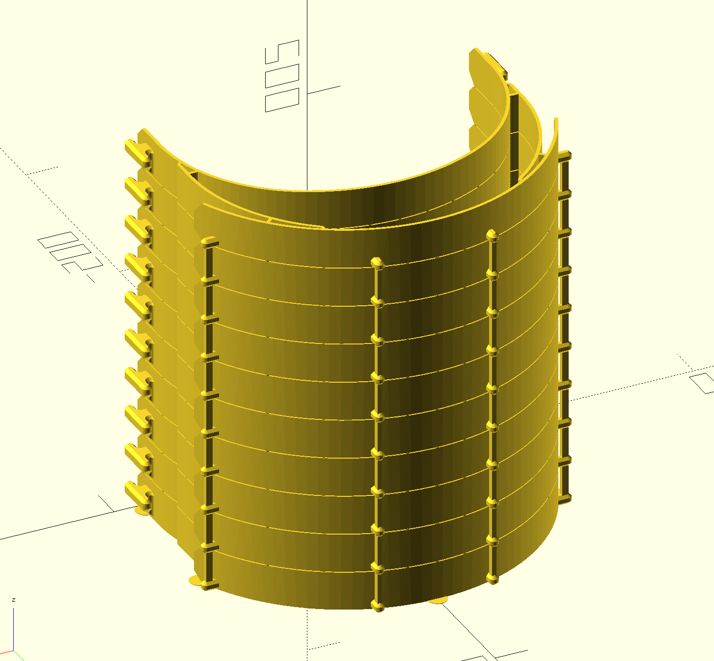

# OpenScad COVID-19 v18 Stacks

This directory contains an [OpenScad](https://www.openscad.org/) script for generating stacks of arbitrary heights of the COVID-19 v18 face shield model.



## Usage

*Instructions here worked on Ubuntu 18.04, but may need to be slightly altered for other operating systems.*

In order to use the script you'll first need to install [OpenScad](https://www.openscad.org/) (further instructions can be found [here](http://ubuntuhandbook.org/index.php/2019/01/install-openscad-ubuntu-18-10-18-04/). 

```
sudo add-apt-repository ppa:openscad/releases
sudo apt-get update
sudo apt-get install openscad
```

Once you've run the above commands you should have `openscad` available to you via command line:

```
chris@ubuntu:~/git/face-shield$ which openscad
/usr/local/bin/openscad
```

You'll now be able to run the accompanying script found in this directory (`covid_19.scad`) to generate a stack of an arbitrary height. Note that rendering time is dependent upon how tall your make the stack, so taller stacks will take longer to generate. In my experience, a stack of 14 face shields took around 60 seconds to finish computing on a fairly beefy machine.

The following command generates a stack of height `6` and saves the output to a file `covid_19_6_stack_v18.stl`:

```
openscad -o covid_19_6_stack_v18.stl covid_19.scad -D "shield_stack(count = 6)"
```

## Printing

I have successfully printed stacks of up to 14 on a Creality CR-10s using a 1.0mm nozzle. With the profile found in the `profiles/creality/foobar` file the printing process for two stacks of 14 on a single bed is 23 hours and takes up 990g of material.

Note that in the default configuration for the model the separators between shields are `0.5mm` tall, so when you're printing your layer height should be `0.5mm` max or you'll risk having the shields printed in a way where they cannot be separated.

If you're using something other than the CR-10s, here are the general parameters I've had success with here:

* **PLA** - Haven't tried PETG but I hear it works well, these settings probably won't work for it.
* **1.0mm nozzle** - I wanted a larger nozzle than half the width of the walls
* **0.8mm line width** - With the larger nozzle we can decrease the line width, increase the flow, and hope some of the "slop" merges the walls
* **0.5mm layer height** - Half the diameter of the nozzle
* **0.2mm initial layer height** - Print the first layer thinner so it's easier to remove the lily pads
* **20% skin overlap percentage** - Allow for the walls to overlap one another
* **107% flow** - Extrude material at 107% of what is otherwise calculated, again hoping to merge the walls
* **217 degree hot end temperature (Hatchbox PLA)** - Hotter than usual to help with de-lamination
* **50mm/s print speed** - Slower for more consistent prints
* **No supports** - The model doesn't require any supports
* **No plate adhesion patterns (skirt, brim, etc)** - Lily pads are provided, so no additional adhesion is required
* **Retraction enabled** - Definitely want to retract between jumps, as this configuration already results in a lot of stringing
* **8mm retraction distance** - Retract a lot to help with stringing
* **45mm/s retraction speed** - Retract quickly too
* **Randomized Z seam alignment** - This configuration on a CR-10s produces noticable problems at the Z seam, so best to distribute those around the print

Note that the resulting prints are optimized for **utility**, not good looks. In my experience so far the resulting prints will have a decent amount of stringing, but the layers will be tightly laminated to one another and the walls will be merged together. You'll need to be a little careful in breaking the stack of shields apart and you'll need to take some wire cutters to remove the supporting columns, but once you do that and give a quick sanding with coarse grit sandpaper the resulting product should look pretty good.

## Modification

I'm no guru when it comes to OpenScad so it's likely I'm doing things in a pretty silly way in there. I encourage folks to make modifications as they see fit.

As things stand presently, there are five variables defined at the top of the `covid_19.scad` file that allow for manipulation. They are:

* **pillar_width** - The width of the support pillars in mm
* **pillar_length** - The depth of the support pillars in mm
* **initial_layer_support_height** - Height of inter-shield supports
* **lily_pad_radius** - Radius of the lily pad adhesion patterns in mm
* **lily_pad_height** - Height of the lily pad adhesion patterns in mm